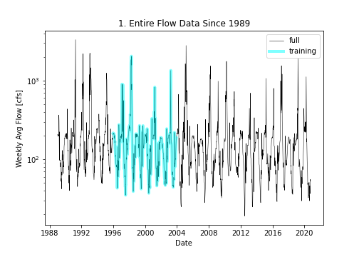
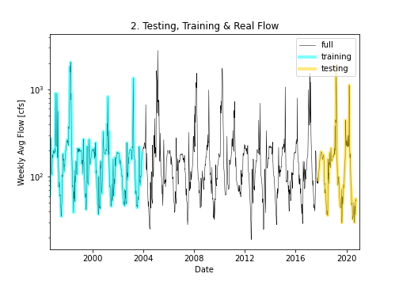
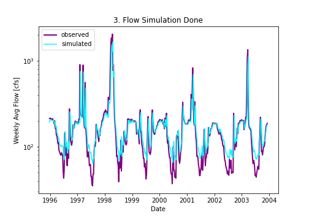
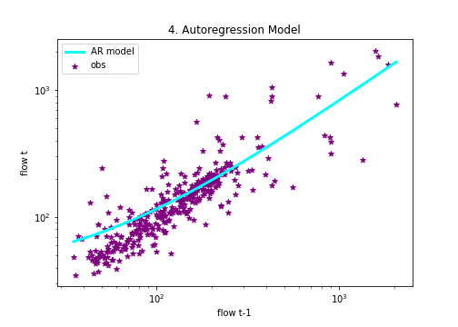
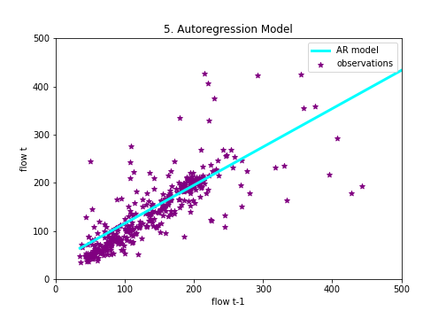

## Homework #7: *Code cleaning and interpretation*
### Evaluator of the code:  *Abigail Kahler*.
### Author of the code:  *Xenia De Gracia Medina*.
### Date: *October 09, 2020*.

---
### Table of Content:
- [ Instructions from Xenia :)](#instructions)
- [ Weekly forecast for submission](#weekly)
- [ Regression based Forecast](#regression)
- [ Code review following the rubric](#review)
- [ Extra information (just in case)](#extra)

---

>### **Instructions from Xenia :)**
*Hello dear evaluator! Here are the instructions to run my code in your own computer. Hopefully it will run well, but just in case, I want to apologize if it gives you any kind of problem and I will definitely owe you an ice cream for that.
Ok... Lets start!*
1. Clone my repo into your computer. I posted the link in here for your easy acces: [homework-xenidegracia](https://github.com/HAS-Tools-Fall2020/homework-xenidegracia)
2. Please download the data from: [USGS Station 09506000 VERDE RIVER](https://waterdata.usgs.gov/nwis/dv?referred_module=sw&site_no=09506000). Since January 1st, 1989, until today.
3. Save it as **".txt"** format, with the name: **"streamflow_week7.txt"**, in the **"data"** folder inside the repository: [homework-xenidegracia/data](https://github.com/HAS-Tools-Fall2020/homework-xenidegracia/tree/master/data).
4. Inside the code: Update the path of the data saved now in your computer to enable the code running. Line 28 of the code.
5. Run the code and get the 4 forecasting values.
6. Locate the **"Medina.CSV"** document, inside the forecasting repo. Here is the link: [forecasting/forecast_entries/](https://github.com/HAS-Tools-Fall2020/forecasting/blob/master/forecast_entries/medina.csv)
7. Please select the values that are printed in the **lines 208 and 215** of the code, as my entries in the CSV document of the forecasting repo.
8. Fill the information asked below this instructions on this markdown file.
9. To fill the *"Regression based Forecast"* section below, use the values obtained in the **lines 190 and 200** of the code.
10. Thank you so much for your suggestions and help with my coding skills.
11. Have a really nice weekend!

---

>### **Weekly forecast for submission**
*Here is the space for the 1st and 2nd week forecast submission values. Those that I recommended for my CSV forecasting entries, printed in the lines 208 and 215 of the code*

- Week 1: 58.22
- Week 2: 58.41

---

>### **Regression based Forecast**
*Please write below the regression based values for 1st and 2nd week forecast.* (Values obtained in the *lines 190 and 200 of the code.)*

- Week 1: 78.03
- Week 2: 80.49

---

>### **Code review following the rubric**
*Special space for the code review.*
(Adapted from Kyle Mandli [Intro to Numerical Methods](https://github.com/mandli/intro-numerical-methods))

- Readability:   3
- Style:         3
- Code awesome:  3

- # Written Review #
- The code is clean and easy to follow, with excellent doc string, comments, and setup instructions in the ReadMe markdown. One improvement in style would be to create a new cell for each set of operations. This makes it easier to identify and troubleshoot error messages, and to follow along with the comments one at a time.

- The variable names were effective and easy to understand.
- Pep8 standards were entirely followed except for line 176 flagged for being just a few characters too long.
- Lines 207 and 214 generated the error 'float' object has no attribute 'round'. I commented out the .round and it generated the prediction. Then I found a way to use round in that statement and changed it on line 207 so you can see. Instead of .round it wanted
-round(the code you have),2)
- The AR model forecast seems much more reasonable than the values a lot of us have been generating, so good job!
- This excellent code might be more streamlined with fewer plots. The starter code we built this on had many plots as examples of what we could do but I think they are each useful for different scenarios and focuses.
- I enjoyed reviewing this code and it gave me ideas of how I can improve on mine and challenge myself more, both with manipulating data and increasing my markdown formatting.

- Abigail Kahler

>### **Extra information (just in case)**
The final equation for the model:
  - **y = 36.24 + 0.79X**

Coefficient of determination:
  - **0.63**

### **Plot #1.**

### **Plot #2.**

### **Plot #3.**

### **Plot #4.**

### **Plot #5.**

