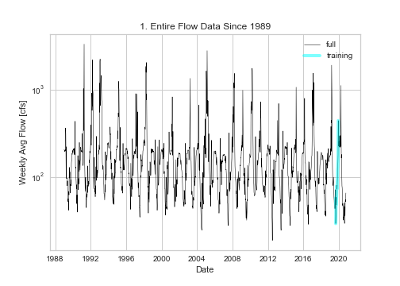
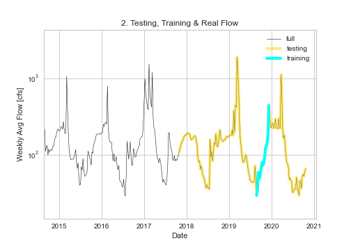
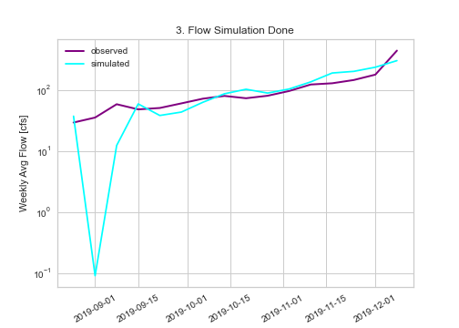
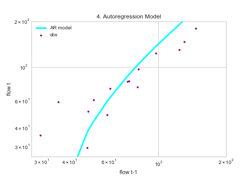
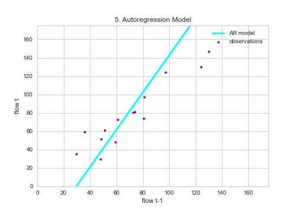
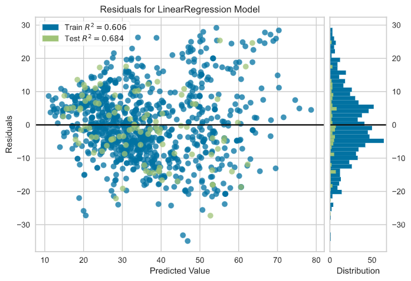

## Homework #8: *Final graded script from section 1* :tada: :fireworks:
### Author of the code:  *Xenia De Gracia Medina*.
### Date: *October 19, 2020*.

---
### Table of Content:
- [ Summary](#summary)
- [ Instructions from the author :)](#instructions)
- [ Weekly forecast for submission](#weekly)
- [ Regression based Forecast](#regression)
- [ Code review following the rubric](#review)

---

>### **Summary**

**1- A brief summary of the AR model you built and why. Use whatever graphs you find helpful.**

  - The equation that my model use to predict is:
    - **y = -59.91 + 2.03X**

  - The Coefficient of determination is:
    - **0.76**
  - The AR model that I built this time, defers from my last code, due to I decided to change the train data to evaluate just the 2019 because it was a dry year too and is seems that the data from the other years was affecting my model and giving me very high flow values compared with the real ones. **(See Plot #1)**

  

  - For the test data, I took the data from the last 3 years to work with.  **(See Plot #2)**

  

  - When I finally got my "Flow Simulation" plot, I realized that my model is not working well at the beginning of the range that I gave to it, nevertheless it is giving me low values for this dry year, and also has a good coefficient of determination.  **(See Plot #3)**

  

**2- An explanation of how you generated your forecasts and why (i.e. did you use your AR model or not?)**

  - In my code I have two methods to obtain my values. The AR based model, and the simple average of the values of 2019. However, I decided to go with my AR based model values due to the average forecast is not working as I wish it could.
  - I made a one time shift of the data to do my linear regression. I created a function that gives me 16 values of the seasonal forecast and also the values for the weekly forecast. After that, - I  made the plots that tell me how is the situation with the model and my data. **(See Plots # 4 and 5)**

  

  

**3- A brief summary of what you got out of the peer evaluation. How did you make your script better?**

  - From my peer evaluation I obtain feedback about improving the path of the data, to make it available for everyone that wants to run my code, also on the writing of my code through the use of more cells to facilitate the execution of it. My evaluator gave me some advices about using more different plots, so I decided to work on the "Residuals Plot" that tells me how my data is far from or close to my model. **(See Plot #6)**

  

**4- Describe the part of your script that you are most proud of and why.**

  - I was so proud when I could finally get how to use the datetime as an object to locate the data that I wanted to process. Also when I got the 16 values of my average and AR forecasting.
  - The fact that now the flake8 corrects me less than at the beginning of the course.

---

>### **AVERAGE Weekly forecast**
- Week 1: 62.66 cfs
- Week 2: 65.35 cfs

---

>### **Regression based Weekly Forecast for submission**
- Week 1: 46.92 cfs
- Week 2: 62.32 cfs

---

Week # |  Start Date  | Flow (cfs)
 ----- | ------------ | ----- |
Week 1 | 2020-08-22   | 37.59
Week 2 | 2020-08-30   | 0.09 ??
Week 3 | 2020-09-06   | 12.46 ??
Week 4 | 2020-09-13   |  59.69
Week 5 | 2020-09-20   |  38.61
Week 6 | 2020-09-27   |  43.88
Week 7 | 2020-10-04   |  63.54
Week 8 | 2020-10-11   |  87.46
Week 9 | 2020-10-18   |  103.68
Week 10 | 2020-10-25  |  89.89
Week 11 | 2020-11-01  |  104.69
Week 12 | 2020-11-08  |  136.92
Week 13 | 2020-11-15  |  191.45
Week 14 | 2020-11-22  |  203.61
Week 15 | 2020-11-29  |  238.07
Week 16 | 2020-12-06  |  304.97

---

>### **Instructions to run the code :)**
*Hi there! Here are the instructions to run my code in your own computer:*
1. Clone my repo into your computer. I posted the link in here for your easy access: [homework-xenidegracia](https://github.com/HAS-Tools-Fall2020/homework-xenidegracia)
2. Please download the data from: [USGS Station 09506000 VERDE RIVER](https://waterdata.usgs.gov/nwis/dv?referred_module=sw&site_no=09506000). Since January 1st, 1989, until today.
3. Save it as **".txt"** format, with the name of the current course week: **"streamflow_week8.txt"**, in the **"data"** folder inside the repository: [homework-xenidegracia/data](https://github.com/HAS-Tools-Fall2020/homework-xenidegracia/tree/master/data).
4. Inside the code: Update the path of the data saved now in your computer to enable the code running.
5. Run the code and get the weekly forecasting values.

---

>### **Code review following the rubric**
(Adapted from Kyle Mandli [Intro to Numerical Methods](https://github.com/mandli/intro-numerical-methods))

  - Readability:   
  - Style:         
  - Code awesome:  
