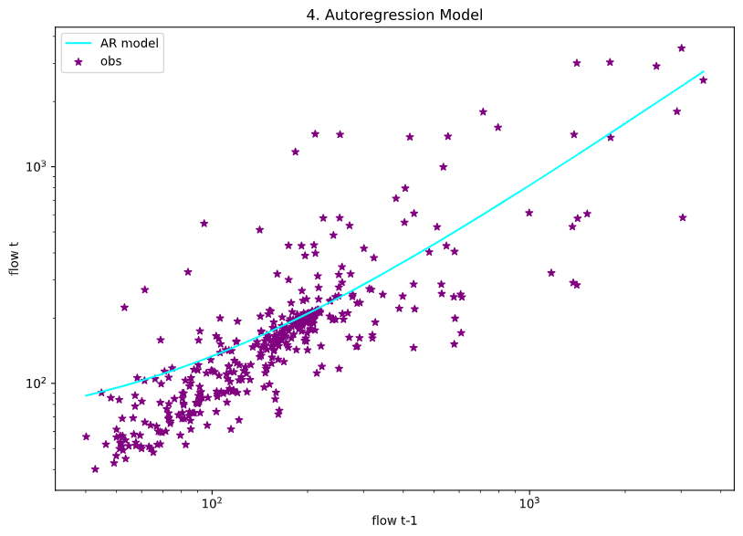

## Homework #6
### Name: Xenia De Gracia Medina.
### Date: October 05, 2020.

---
### Table of Content:
- [ Weekly Forecast](#weekly)
- [ Seasonal Forecast](#seasonal)
- [ Summary](#Q1)
- [ Graph Analysis](#Q2)
- [ Discussion](#Q3)

---

>### **Weekly forecast**

*I will take the risk with the weekly forecast, and will trust on my first Python regression ever. So,  my AR model for this week says that the flow will be **87.85 cf/s**. It is higuer than my last forecastings... Maybe because Autumn is coming!?*

---

>### **Seasonal Forecast**

*For the Seasonal forecast, I continue using the average of 2019.*

---
>### **Assignment questions**

1. A summary of the AR model that you ended up building, including: 

- What you are using as your prediction variables.
  - My prediction variables are my flow data range **from 1996 to 2004**, because I saw that it was the most similar range data to continue predicting.
- The final equation for your model
  - My final equation for my model is: **y = 57.19 + 0.76X**
- What you used as your testing and training periods. In your discussion please include graphical outputs that support why you made the decisions you did with your model.
  - My training period was the flow data range **from 1996 to 2004**, because I saw that it range has an average behaviour that could be useful to continue predicting. *(See Plot #1)*. Meanwhile, my testing prediction was the **last 156 weeks**, that means the last 3 years approximately. *(See Plot #2)*.

### **Plot #1.**

### **Plot #2.**

2. Provide an analysis of your final model performance. This should include at least one graph that shows the historical vs predicted streamflow and some discussion of qualitatively how you think your model is good or bad.
- On **plot #2** we observed the historical data, and the training and testing lines, however, **Plot #3** shows us the simulation done between 1996 and 2004, and it fits very well.

### **Plot #3.**

- Also, on **plot #4** we can see the distribution of the data, and it seem pretty similar to the line tendency that the model is giving to us. The **Coefficient of Determination was 0.58**. This coefficient is not the lowest or the highest but I think it could be a good value for representing a BIG data like this one that contains dataflows from 1989 to nowadays. We must remember to not overfitting our model, because it aims is to predict future data, not just fit the current data.

### **Plot #4.**

### **Plot #5.**

3. Finally, provide discussion on what you actually used for your forecast. Did you use your AR model, why or why not? If not how did you generate your forecast this week?
  - My calculations indicates that the average value for this week is: 
  **57.3 cf/s**. However, as I said, I will use my AR model, and for this week the forecast is **87.85 cf/s**. I liked the coefficient of determination and also the plots showed a good linear approach with the historical data.

