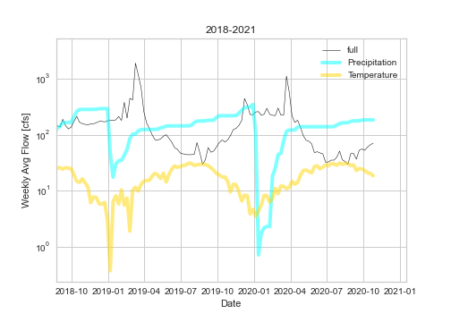

## Homework #9: *Reading data and APIs*
### Author of the code:  *Xenia De Gracia Medina*.
### Date: *October 26, 2020*.

---
### Grade
3/3 - Nice job
___
### Table of Content:
- [ Questionnaire](#quest)
- [ Weekly forecast for submission](#weekly)
- [ Regression based Forecast](#regression)
- [ Instructions from the author](#instructions)

---

>### **Questionnaire**

**1- A brief summary of how you chose to generate your forecast this week.**
- I choose the average forecast based on 2019 data an not my AR model, because I thing I have to improve my model with the new data that I inserted.

**2- A description of the dataset you added.**
- I added two new parameters, the Temperature and the Precipitation. This parameters were stored at a total different format on the JSON document, than the flow data that I used to download for coding.

**3- What is the dataset? Why did you choose it?**
- The dataset that I worked with, is the Mesowest webpage that has different stations near the Verde River and it contains important information like daily precipitation, temperature, humidity, and others.
- I decided to choose this dataset because I think it is complete and has a good quantity of data with a lot of different parameters, so I think in the future I could continue using this dataset with more variables.

**4- What location have you chosen?**
- I choose the "Verde" station as suggested on the starter code.

**5- Where did you get the data from?**
- I got the data from the Mesowest webpage.

**6- What was your approach to accessing it?**
- It was difficult for me to finally comprehend how to work with the directory to obtain the data requested. I had to try a lot of times charging the data, and to do that I used the "demotoken" that you and Quinn recommended, it was pretty useful.

**7- A plot of your additional time series along with your streamflow time series.**

---

>### **AVERAGE Weekly forecast**
- Week 1: 67.21 cfs
- Week 2: 70.65 cfs

---

>### **Regression based Weekly Forecast for submission**
- Week 1: 51.61 cfs
- Week 2: 43.77 cfs

---

>### **Instructions to run the code :)**
*Hi there! Here are the instructions to run my code in your own computer:*
1. Clone my repo into your computer. I posted the link in here for your easy access: [homework-xenidegracia](https://github.com/HAS-Tools-Fall2020/homework-xenidegracia)
2. The data was obtained from: [USGS Station 09506000 VERDE RIVER](https://waterdata.usgs.gov/nwis/dv?referred_module=sw&site_no=09506000). Since January 1st, 1989, until today. The other resource used was: [Mesowest](http://api.mesowest.net/v2/stations/timeseries?start=199701010000&end=202010240000&obtimezone=UTC&vars=air_temp%2Cprecip_accum&stids=QVDA3&units=temp%7CC%2Cprecip%7Cmm&token=demotoken).
3. Run the code and get the weekly and seasonal forecasting values.
