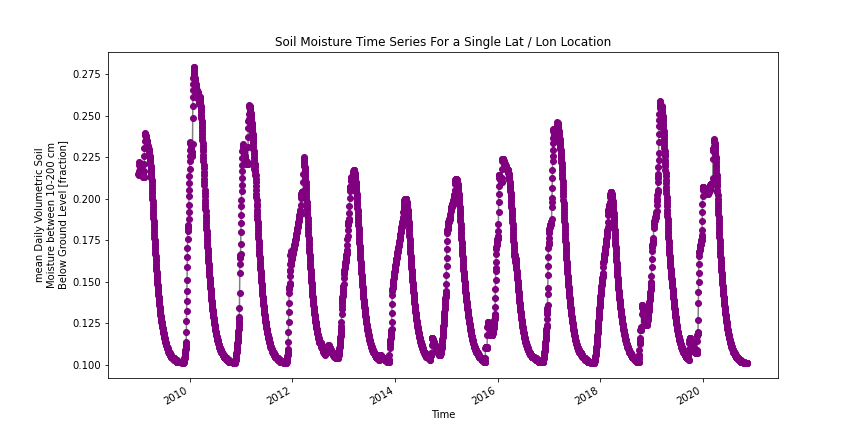
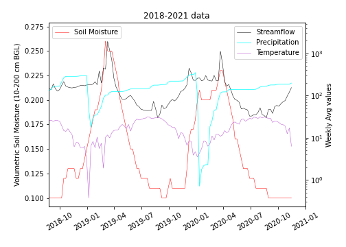
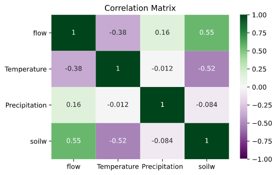
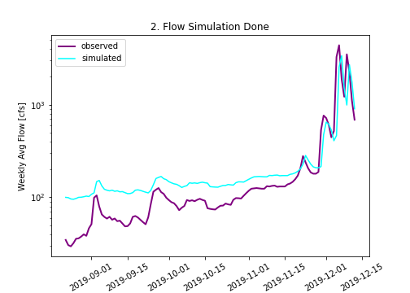

## Homework #12: ***Hierarchical Data***
### Author of the code:  *Xenia De Gracia Medina*. :blush:
### Date: *November 16, 2020*.
___
### Grade
3/3 - Great job! I really like all of the analysis you did here.

---
### Table of Content:
- [ Questionnaire](#quest)
- [ Average Weekly forecast](#weekly)
- [ Regression based Forecast for submission](#regression)

---

>### **Questionnaire**

**1. A brief summary of the how you chose to generate your forecast this week.**

I decided to use my Autoregression model, now with the daily values instead of the weekly values.

**2. A description of the dataset you added:**
- **What is the dataset? Why did you choose it?**

The dataset that I chose was the ***Volumetric Soil Moisture***.

At the beginning I was looking for the content of soil moisture, but I didn’t find it, so I decided to use the Volumetric Soil Moisture ratio between 10 to 200 cm below ground level. It is the ratio of water volume to soil volume.

- **What is the spatial and temporal resolution and extent of the data?**

I used the bounding box suggested:

- Latitude from 34N to 36N

- Longitude from247E to 249E

The time lapse used for the dataframe was:

- Start date: 2009-01-01

- End date: 2020-11-12

- **Where did you get the data from?**

I grabbed my dataset from the [NOAA Physical Science Laboratory webpage](https://psl.noaa.gov/cgi-bin/DataAccess.pl?DB_dataset=NCEP+Reanalysis+Daily+Averages&DB_variable=Volumetric+Soil+Moisture&DB_statistic=Mean&DB_tid=89392&DB_did=195&DB_vid=1277)

- **What was your approach to extracting and aggregating it into something useful to you?**
I was so exited when I realized the high correlation between the soil moisture that I extracted from the dataset, and the flow and also between the soil moister and the temperature. That confirms the relation that they have and how the streamflow that we are studying is affected by those factors.

**3. A plot of the dataset you added. This can be a timeseries, map, histogram or any other plot that you think is a good summary of what you added.**

**4. Finally add your plot and a brief summary of what you did to our slide deck for this week here.**

I added this plot to the class slides, because on it we can see the relation between the soil moisture and the streamflow, and also the temperature.

I did not put the Correlation matrix on the class slides, but I did put it in here, to demostrate better what I was explaining above.

---

>### **AVERAGE Weekly forecast**
    Week 1: 130.09 cfs
    Week 2: 140.64 cfs

---

>### **Regression based Weekly Forecast for submission**
    Week 1: 143.84 cfs
    Week 2: 171.79 cfs

