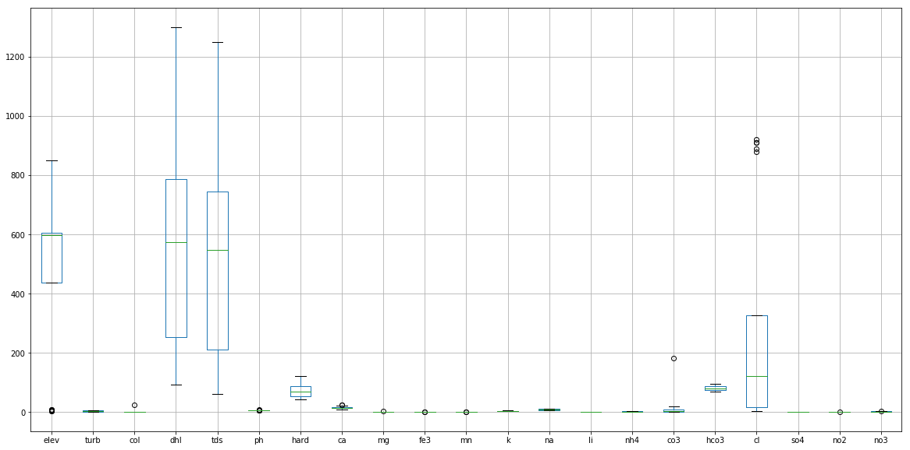

## Homework #14: *FAIR Science*
### Author:  *Xenia De Gracia Medina*.
### Date: *December 01, 2020*.

## Grade
3/3 - nice work.
---
### Table of Content:
- [ Questionnaire](#quest)
- [ Example of Data Visualization from the project](#visual)

---

>### **Questionnaire**

#### 1. **What is the paper or project you picked? Include a title, a link to the paper and a 1-2 sentence summary of what its about.**

- Title of the project: ***`Using hydrochemistry and simple visualization to differentiate groundwater samples`***. Authors: *Dasapta Erwin Irawan, Arif Susanto, Prihadi Sumintadireja, Budi Brahmantyo, Deny Juanda Puradimaja*.

- Link from: [www.authorea.com](https://www.authorea.com/users/87737/articles/276899-using-hydrochemistry-and-simple-visualization-to-differentiate-groundwater-samples). ***NOTE: Use Google Translator Extension to translate the entire webpage easily!***

- Summary: Project presented on the 2018 International Geothermal Workshop (IIGW), about the development of a simple data visualization that allows to find the difference or similarity of groundwater samples, thus contributing to differentiating the hydrogeological system by knowing its hydrochemical composition.

#### 2. **What codes and/or data are associated with this paper? Provide any link to the codes and datasets and a 1-2 sentence summary of what was included with the paper (i.e. was it a GitHub repo? A python package? A database? Where was it stored and how?)**

- Link to GitHub repository: [dasaptaerwin/iigw2018](https://github.com/dasaptaerwin/iigw2018)

- Summary: This project has a **GitHub repository** where they store **CSV datasets** with the physical and chemical properties of each sample done to the groundwater. Also they keep the **JupyterNotebook** file which they used to work on the visualizations.

#### 3. **Summarize your experience trying to understand the repo: Was their readme helpful? How was their organization? What about documentation within the code itself?**

- The README was very helpful. It included the description of the dataset, the outputs and the main file used for coding, also the instructions to run it. As it is a *JupyterNotebook*, everything was stored at the same repo, so I didn't have problems to run or find the information on it.

#### 4. **Summarize your experience trying to work with their repo: What happened? Where you successful? Why or why not?**

- I cloned their repo to my computer, and as the *README* instructions said, I looked for the file named ***IIGW2018-Copy1.ipynb***, and it began to run from my *VSCode*, showing all the results and data visualizations without any problem.

#### 5. **Summarize your experience working with the data associated with this research. Could you access the data? Where was it? Did it have a DOI? What format was it in?**

- Yes, I could access to the data. It was a [CSV file](https://github.com/dasaptaerwin/iigw2018/blob/master/data_arifs_2.csv), stored on the same repo as the execution file.

- The project do have a DOI (Digital Object Identifier) from ZENODO repository. It is: 

#### 6. **Did this experience teach you anything about your own repo or projects? Things you might start or stop doing?**

- It taught me about the importance of having a very well explained README file. It is the base of the understanding for other users and also if myself wants to visit the repo again after years. In this case this repo exists since 2018, and I could read it easily because the good explanation and storage of the information.

- In addition to that, I didn't know about the existence of the DOIs. Is a helpful tool  to keep the functionality of our codes  over time.

---

>### **Example of Data Visualization from the project**

