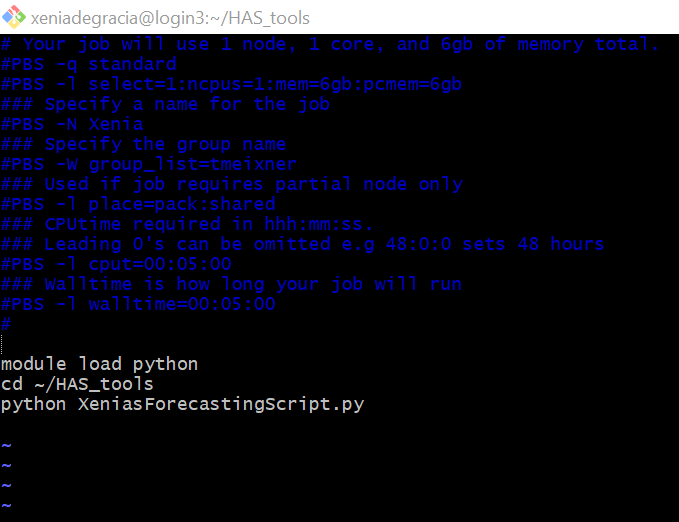
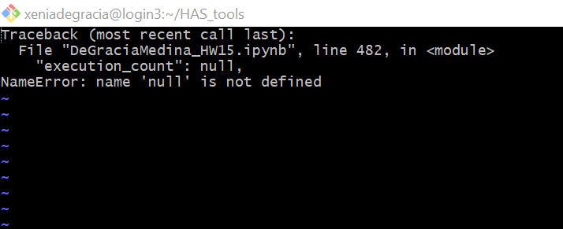
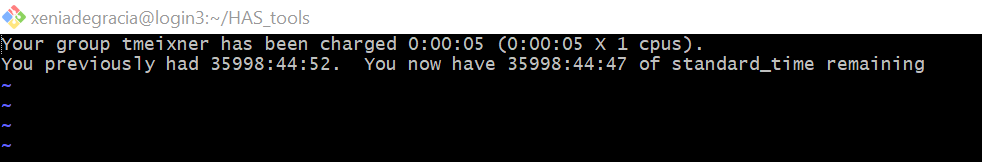
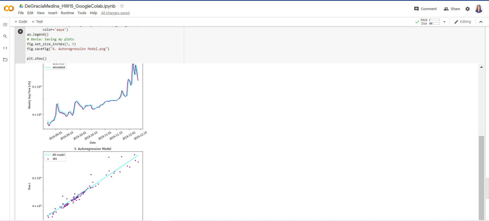
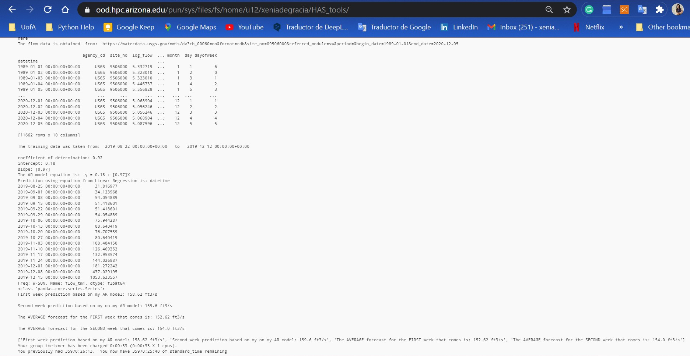

## Homework #15: *Computing resources*
### Author:  *Xenia De Gracia Medina*.
### Date: *December 07, 2020*.

#### Grade
3/3 - Nice work with the debugging! In answer to your question - yes Ocelote can write outputs like csvs and plots. 

---
### Table of Content:
- [ Questionnaire](#quest)

---

>### **Questionnaire**

### 1. What resources did you request on Ocelote? How long did you wait in the queue for your job to run and how long did it take to run?

- I requested 1 node, 1 core and 6gb of memory total.

**View of the run_python.pbs**

### 2. What was the most confusing part to you about setting up and running your job on Ocelote?

Between my confusing moments were:

1. Trying to remember the commands to work on `GitBash`.

2. When I was trying to localize my `run_python.pbs` on my directory, it told me a lot of times that *the file didn't exist on the current directory*.

3. The `#M` that were hidden on my script. Thanks so much for sharing the instructions to helping us with this situation.

4. I began trying to run a `JupyterNotebook` from the GitBash, but it gave me an ERROR about *'name null is not defined'* so I changed my file to a `.py`, looking for it to be easier to work with.

5. When I got to run the script, it told me that time was charged to `tmeixner`, but it didn't show me any of my results.

### 3. Where else did you run your job? How did the setup compare to your run on Ocelote?

- I decided to use `Google Colab` to save time because it is easy to use, it seems pretty similar to Jypyter Notebook.
- I found `GoogleColab` easier then `Ocelote` because on `Ocelote` I had to set up carefully to made it run and obtain results.

**Obtaining results on Google Colab:**

**Obtaining results on Ocelote:**

### 4. What questions do you still have after doing this?

- Can Ocelote give me the plot figures and a .CSV with my results, if I request them on my script?
